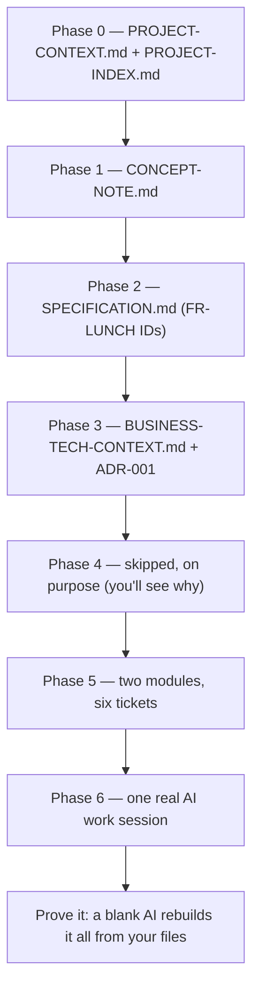

# Hands-On Walkthrough: Your First AI-DLC Project

You are about to run an entire AI-Driven Development Lifecycle (AI-DLC) project, end to end, on your own computer, in one or two sittings. Not a real project — a deliberately tiny, fictional one — but you will produce every document the real process produces, make a real architecture decision, break work into real tickets, and run a real AI work session. By the end you will have *felt* why AI-DLC works, instead of just reading about it.

No experience required. You do not need to be a programmer. You do not need any special tools. If you have read [What is AI-DLC?](00-what-is-ai-dlc.md), [AI Assistant Basics](00-ai-assistant-basics.md), and [Repos, Git, and Terminals](00-repo-basics.md), you have everything you need. (If you skipped those, this page still works — but they explain the "why" behind every step here.)

**Time:** roughly 90 minutes to 2 hours. You can stop after any phase and pick up later — that is, in fact, part of the lesson.

---

## Meet Lunchbox

Your sandbox project is **Lunchbox** — a simple web page for deciding where a small team orders lunch. Here are the project facts. You will reuse them constantly, so read them twice:

- **The team:** 5 people in one office. Every workday they order lunch together, and every workday the "where from?" debate eats twenty minutes.
- **The idea:** one simple web page. Each morning the office manager, **Dana**, posts 2–4 lunch options (restaurant names). Each team member votes for exactly one option and can change their vote until voting closes.
- **Voting closes at 11:00 sharp.** After that, the page shows the winning option and the vote counts.
- **No login.** Voters pick their name from a fixed list of the 5 team members.
- **The build:** one part-time developer, **Sam**, and a **2-week timeline**.
- **Explicitly not building:** food ordering, payments, user accounts, a mobile app, vote history or statistics.

Everything is fictional, so nothing is at risk. If the AI produces something odd, nothing breaks. That is exactly why we practice here first.

Here is the journey ahead — each phase produces a document the next one builds on:



A complete worked solution exists — the [Lunchbox reference (answer key)](examples/lunchbox/README.md). Do each phase yourself first, then compare your file against the reference at the checkpoint. Your wording will differ; the shape and facts should match.

---

## Set up (10 minutes)

You need exactly two things:

1. **Any AI assistant** (e.g. Claude, ChatGPT, Cursor, GitHub Copilot). A free plain-chat account is enough.
2. **One folder on your computer.**

Create a folder called `lunchbox-architecture` anywhere you like (Desktop is fine). This folder plays the role of the [context repo](glossary.md) — the single home for all project documents. Then pick your path:

**OPTION A — no tools (plain chat).** You will work in a browser chat (Claude, ChatGPT, etc.). After each phase, copy the AI's output into a text file and save it into `lunchbox-architecture` yourself (any text editor works — Notepad, TextEdit in plain-text mode, or VS Code). When a prompt says "load a file", you open your saved file, copy its contents, and paste them into the chat.

**OPTION B — agentic tool.** If your AI tool can read and write files in a folder (e.g. Claude Code, Cursor, Copilot in an editor — the [agentic](00-ai-assistant-basics.md) kind), open `lunchbox-architecture` in that tool and let it create and read the files directly. Each phase below includes a one-line agentic variant of the prompt.

**No Git today — on purpose.** Real projects keep the context repo in a shared, hosted repository so the whole team (and the review process, via pull requests (PRs)) can see it — that side is covered in [Repos, Git, and Terminals](00-repo-basics.md). For this practice run, a plain local folder teaches the same lessons with zero setup.

One rule for the whole exercise, straight from [AI Assistant Basics](00-ai-assistant-basics.md): **start a new chat for every phase, and load your files at the start of it.** It will feel wasteful. It is the entire point — you are proving, seven times in a row, that the documents carry the project, not the chat history.

---

## Phase 0 — Project context

**What you're doing and why.** Phase 0 writes down what the project *is* before anyone designs or builds anything: the problem, the constraints, the risks. You will create two files — `PROJECT-CONTEXT.md` (the full picture) and a mini `PROJECT-INDEX.md` (the one-page index every future session starts from). These are your first [hot files](glossary.md): small documents loaded at the start of every AI session.

**Do this.**

1. Open a **new chat** and paste this prompt (both options — there is nothing to load yet):

   ```markdown
   I'm doing a practice run of the AI-DLC document process with a toy
   project. Project facts:

   - Name: Lunchbox — a single web page where a 5-person team votes on
     where to order lunch.
   - Every workday morning the office manager (Dana) posts 2-4 lunch
     options. Each team member votes for exactly one option and can
     change their vote until voting closes at 11:00. After 11:00 the
     page shows the winning option and the vote counts.
   - No login: voters pick their name from a fixed list of the 5 team
     members.
   - Build: one simple web page, one part-time developer (Sam),
     2-week timeline.
   - Not building: food ordering, payments, user accounts, a mobile
     app, or vote history.

   Draft PROJECT-CONTEXT.md for Lunchbox with these sections: problem
   domain; project type (greenfield); proposed technology stack (keep
   it minimal, justify each choice, mark it "proposed — decision in
   Phase 3"); constraints (technical, business, timeline); risks; open
   questions. Keep it under one page. If anything is genuinely
   unclear, ask me up to 3 questions first; otherwise proceed.
   ```

2. Answer any questions it asks (invent reasonable answers — Dana would). Read the draft. Fix anything that contradicts the facts above.
3. Save the result as `PROJECT-CONTEXT.md` in your folder (Option B: ask the tool to write the file).
4. In the **same chat**, ask for the index:

   ```markdown
   Now create a mini PROJECT-INDEX.md for Lunchbox: a Quick Facts
   table (project name, type, tech stack, current phase, one-line
   status), a 2-sentence vision, and a Documents table listing each
   project file with a one-line purpose (just PROJECT-CONTEXT.md so
   far). We will extend it as documents are added. Keep it under half
   a page.
   ```

5. Save that as `PROJECT-INDEX.md`.

These two files are lightweight versions of the playbook's real templates — compare yours with [templates/PROJECT-CONTEXT-template.md](templates/PROJECT-CONTEXT-template.md) and [templates/PROJECT-INDEX-template.md](templates/PROJECT-INDEX-template.md) to see what the full-size versions add.

> **Why this matters on a real project:** Phase 0 is where an architect makes sure no one — human or AI — starts work on wrong assumptions; the real steps are in [11.04 — Phase 0: Project Context](guides/11.04-phase-0-project-context.md). On a real project this file lives at `docs/00-project-context/PROJECT-CONTEXT.md` (in your context repo, created from the template).

**Checkpoint.** Before moving on, verify:

- [ ] `PROJECT-CONTEXT.md` and `PROJECT-INDEX.md` both exist in your folder.
- [ ] The context file states the 11:00 close, the 5-person team, the 2-week timeline, and the no-login rule.
- [ ] The "not building" list appears somewhere (constraints or scope notes).
- [ ] No template placeholders like `{...}` or "TBD" without an owner remain.
- [ ] `PROJECT-INDEX.md` says the current phase is 0 and lists `PROJECT-CONTEXT.md`.

Compare with the reference: [PROJECT-CONTEXT.md](examples/lunchbox/PROJECT-CONTEXT.md) and [PROJECT-INDEX.md](examples/lunchbox/PROJECT-INDEX.md) *(the reference index shows its final, end-of-walkthrough state — at this point yours lists just one document).*

---

## Phase 1 — Concept note

**What you're doing and why.** The concept note is the product manager's (PM's) document: vision, users, what is in scope, and — most importantly — what is **out of scope**. Writing down what you are *not* building is what stops an eager AI (or teammate) from helpfully building it later.

**Do this.**

1. Start a **new chat**. Load your Phase 0 files and ask for the draft:

   ```markdown
   I'm working on Lunchbox, a practice AI-DLC project: a one-page web
   app where a 5-person team votes each morning on lunch options
   posted by the office manager; voting closes at 11:00; one
   developer; 2-week timeline. Here are the current project documents:

   --- PROJECT-CONTEXT.md ---
   [paste the contents of your PROJECT-CONTEXT.md]
   --- PROJECT-INDEX.md ---
   [paste the contents of your PROJECT-INDEX.md]

   Draft CONCEPT-NOTE.md with: vision (2 short paragraphs); target
   users (a small table); in-scope features grouped as must have /
   should have / could have; an explicit out-of-scope list with a
   one-line reason per item (include at least: ordering food,
   payments, user accounts, mobile app, vote history); one or two
   success metrics a 5-person team could actually measure; and the
   top 3 risks. Stay consistent with the loaded documents — flag any
   contradiction instead of silently fixing it.
   ```

   *Option B one-liner:* `Load PROJECT-CONTEXT.md and PROJECT-INDEX.md, then draft CONCEPT-NOTE.md with vision, target users, in-scope (must/should/could), explicit out-of-scope with reasons, success metrics, and top 3 risks.`

2. Play stakeholder: read the vision as if you were Dana. Would she recognize her idea? Edit until yes — you approve documents, the AI drafts them.
3. Save as `CONCEPT-NOTE.md`, and ask the AI (same chat) for an updated Documents table for `PROJECT-INDEX.md` — then update your saved index (phase: 1 complete).

The full-size version of this document is [templates/CONCEPT-NOTE-template.md](templates/CONCEPT-NOTE-template.md).

> **Why this matters on a real project:** scope disputes are cheapest to settle here, before a single requirement is written — see [11.05 — Phase 1: Concept Note](guides/11.05-phase-1-concept-note.md) for the review and approval steps real teams add.

**Checkpoint.**

- [ ] The vision fits in 2 paragraphs and mentions the morning vote and the 11:00 close.
- [ ] "Must have" contains posting options, voting, and showing the result — and little else.
- [ ] The out-of-scope list has at least 5 items, each with a reason.
- [ ] Success metrics are measurable by a 5-person team (e.g. "lunch decided by 11:05 on 9 of 10 days"), not vanity numbers.
- [ ] `PROJECT-INDEX.md` now lists two documents and phase 1 complete.

Compare with the reference: [CONCEPT-NOTE.md](examples/lunchbox/CONCEPT-NOTE.md)

---

## Phase 2 — Specification

**What you're doing and why.** Now every in-scope feature becomes a numbered requirement with **testable acceptance criteria**. The numbering matters more than it looks: each ID — `FR-LUNCH-001`, `FR-LUNCH-002`, … — is a stable, permanent name (FR stands for [functional requirement](glossary.md)). Tickets, tests, and code will all point back at these IDs, so they are **never renamed** once written.

**Do this.**

1. **New chat.** Load and draft:

   ```markdown
   I'm working on Lunchbox, a practice AI-DLC project: a one-page web
   app where a 5-person team votes each morning on lunch options
   posted by the office manager; voting closes at 11:00; one
   developer; 2-week timeline. Here is the concept note:

   --- CONCEPT-NOTE.md ---
   [paste the contents of your CONCEPT-NOTE.md]

   Draft SPECIFICATION.md. Use stable requirement IDs in the form
   FR-LUNCH-NNN and state at the top that IDs are never renamed once
   assigned. Cover these six requirements, numbered in exactly this
   order:
   1. Dana posts 2-4 lunch options each morning
   2. A team member casts a vote (pick own name from the fixed list
      of 5, pick one option, one vote per person)
   3. A voter can change their vote any time before 11:00
   4. Voting closes at 11:00; votes are rejected after that
   5. After 11:00 the page shows the winning option and per-option
      vote counts
   6. Ties are broken in favor of the option that was posted first

   For each: ID, title, priority (must/should/could), a 1-2 sentence
   description, and 2-4 acceptance criteria written so a tester could
   check each one (checkbox list). End with an "Explicitly out of
   scope" section copied from the concept note.
   ```

   *Option B one-liner:* `Load CONCEPT-NOTE.md and draft SPECIFICATION.md with stable FR-LUNCH-NNN IDs covering the six requirements above, each with testable acceptance criteria, plus the out-of-scope section.`

2. Read every acceptance criterion and ask of each: *could a tester mark this pass or fail without asking anyone?* "Voting is easy to use" fails that test; "a voter's second vote replaces their first" passes. Ask the AI to tighten any vague ones.
3. Save as `SPECIFICATION.md`. Update `PROJECT-INDEX.md` (three documents, phase 2 complete).

The full-size version is [templates/SPECIFICATION-template.md](templates/SPECIFICATION-template.md). If your AI numbered things differently, either regenerate with the ordering above or adjust the walkthrough's IDs to yours from here on — just never renumber *after* this point.

> **Why this matters on a real project:** stable IDs are what make an AI's work traceable — every ticket and test names the FR it satisfies; see [11.06 — Phase 2: Specification](guides/11.06-phase-2-specification.md), including its list of ID mistakes to avoid.

**Checkpoint.**

- [ ] `SPECIFICATION.md` has 6 requirements, `FR-LUNCH-001` through `FR-LUNCH-006`.
- [ ] `FR-LUNCH-002` is the vote-casting requirement (you will need it in Phase 6).
- [ ] Every acceptance criterion is pass/fail checkable by a tester.
- [ ] The 11:00 cutoff and the tie rule each appear in exactly one requirement.
- [ ] The out-of-scope section matches the concept note.

Compare with the reference: [SPECIFICATION.md](examples/lunchbox/SPECIFICATION.md)

---

## Phase 3 — Business/tech context and your first ADR

**What you're doing and why.** Two artifacts here. First, a short `BUSINESS-TECH-CONTEXT.md` connecting business goals to technical choices. Second — the star of this phase — your first **[Architecture Decision Record (ADR)](glossary.md)**: a short numbered document that records *one* technical decision: the context, the options considered, the decision, and its consequences. ADRs exist so that six months from now, nobody (human or AI) has to guess *why* the system is built the way it is.

Lunchbox has a genuine decision to make: **plain HTML page with a little JavaScript, or a web framework (React, Vue, …)?**

**Do this.**

1. **New chat.** Load context and draft the business/tech context:

   ```markdown
   I'm working on Lunchbox, a practice AI-DLC project: a one-page web
   app where a 5-person team votes each morning on lunch options;
   voting closes at 11:00; one developer (Sam); 2-week timeline.
   Loaded documents:

   --- PROJECT-CONTEXT.md ---
   [paste]
   --- CONCEPT-NOTE.md ---
   [paste]

   Draft a short BUSINESS-TECH-CONTEXT.md: the business goal in one
   paragraph, who benefits and how, what "success" looks like after
   2 weeks, and the technical constraints that follow from the
   business reality (5 users, one developer, no budget, must be
   trivially easy to host and maintain).
   ```

2. Save as `BUSINESS-TECH-CONTEXT.md`. Then, same chat, run the decision:

   ```markdown
   Now help me make an architecture decision to record as ADR-001:
   should Lunchbox be a plain HTML page with a small amount of
   JavaScript, or use a web framework (React, Vue, or similar)?

   Present both options with honest trade-offs FOR THIS PROJECT
   (5 users, one part-time developer, 2 weeks, one page). Recommend
   one. Do not write the ADR yet — wait for my decision.
   ```

3. Read the trade-offs and **decide yourself** — the AI recommends, the human decides. (For a one-page app with 5 users, plain HTML is very hard to argue against — but the decision is yours.) Then:

   ```markdown
   Decision: [your choice]. Write ADR-001 titled "Page technology"
   with sections: Status (Accepted), Context, Options considered,
   Decision, Consequences (positive and negative). Keep it under
   half a page.
   ```

4. Save as `ADR-001-page-technology.md`. Update `PROJECT-INDEX.md`: five documents now, a "Key decisions" line for ADR-001, phase 3 complete.

   *Option B one-liner (whole phase):* `Load PROJECT-CONTEXT.md and CONCEPT-NOTE.md; draft BUSINESS-TECH-CONTEXT.md; then walk me through the plain-HTML-vs-framework decision and, after I decide, write ADR-001-page-technology.md and update PROJECT-INDEX.md.`

> **Why this matters on a real project:** real projects require ADR-001 (platform/stack) and ADR-002 (architecture pattern) to be accepted before any breakdown or coding starts — see [11.07 — Phase 3: Business + Tech Context and ADRs](guides/11.07-phase-3-business-tech-context.md).

**Checkpoint.**

- [ ] `BUSINESS-TECH-CONTEXT.md` links the "one developer, 2 weeks" reality to technical constraints.
- [ ] `ADR-001-page-technology.md` exists with Status: Accepted.
- [ ] The ADR records the option you did **not** choose, and why.
- [ ] Consequences include at least one honest negative of your choice.
- [ ] `PROJECT-INDEX.md` lists ADR-001 under key decisions.

Compare with the reference: [BUSINESS-TECH-CONTEXT.md](examples/lunchbox/BUSINESS-TECH-CONTEXT.md) and [ADR-001-page-technology.md](examples/lunchbox/ADR-001-page-technology.md) *(your decision may differ — the shape is what matters).*

---

## Phase 4 — Context directories (you get to skip one)

**What you're doing and why.** Phase 4 creates *context directories* — one briefing file per business domain (authentication, catalog, payments, …) so an AI session can load just the domain it is working on. That pays off on **big** projects: many domains, multiple teams, hot files too small to hold everything. Lunchbox is one domain ("lunch"), five users, and six requirements — its entire truth already fits in the hot files. So Phase 4's correct move here is the one real teams make constantly and beginners find hardest: **deliberately skip it, and write down that you did.** An undocumented skip looks like an oversight; a documented skip is a decision.

**Do this.**

1. Open your saved `PROJECT-INDEX.md` and add one line under status: `Phase 4 (context directories): skipped — single-domain project, hot files sufficient.` That is the whole phase.

> **Why this matters on a real project:** the skip conditions (small project, single domain, hot files sufficient) are listed right at the top of [11.08 — Phase 4: Context Directories](guides/11.08-phase-4-context-directories.md) — knowing when *not* to produce documents is part of the method.

**Checkpoint.**

- [ ] `PROJECT-INDEX.md` records the Phase 4 skip and the reason.
- [ ] You created no empty folders or placeholder files "just in case".
- [ ] You can say in one sentence when a project *would* need Phase 4.

Compare with the reference: the Phase Log in [PROJECT-INDEX.md](examples/lunchbox/PROJECT-INDEX.md) shows how the skip is recorded.

---

## Phase 5 — Breakdown: modules and tickets

**What you're doing and why.** [Breakdown](glossary.md) turns the specification into work: [modules](glossary.md) (bounded feature areas) containing tickets (small, implementable tasks with IDs like `LUNCH-001`). A good ticket names the FRs it satisfies and says what "done" means — which is exactly what makes an AI session productive: one ticket, one session, clear finish line.

**Do this.**

1. **New chat.** Load and break down:

   ```markdown
   I'm working on Lunchbox, a practice AI-DLC project: a one-page web
   app where a 5-person team votes each morning on lunch options;
   voting closes at 11:00; one developer; 2-week timeline; ADR-001
   chose [your ADR-001 decision]. Here is the specification:

   --- SPECIFICATION.md ---
   [paste]

   Produce two module breakdown documents:

   MODULE-01-vote.md — module: Vote. Tickets:
   - LUNCH-001: Page skeleton showing today's options (FR-LUNCH-001)
   - LUNCH-002: Cast and change a vote (FR-LUNCH-002, FR-LUNCH-003)
   - LUNCH-003: Close voting at 11:00 (FR-LUNCH-004)

   MODULE-02-results.md — module: Results. Tickets:
   - LUNCH-004: Tally votes per option (FR-LUNCH-005)
   - LUNCH-005: Show winner and counts after 11:00 (FR-LUNCH-005)
   - LUNCH-006: Tie and no-votes handling (FR-LUNCH-006)

   For each module: a small metadata table (module name, spec refs,
   depends on). For each ticket: ID, title, FR references, 2-3
   sentences on what to build, and a "done when" checklist derived
   from the acceptance criteria of its FRs.
   ```

   *Option B one-liner:* `Load SPECIFICATION.md and ADR-001-page-technology.md, then produce MODULE-01-vote.md and MODULE-02-results.md with the six tickets listed above, each with FR references and a done-when checklist.`

2. Check the traceability yourself: every ticket names at least one FR, and every FR appears in at least one ticket. Ask the AI to fix any orphans.
3. Save both files. Update `PROJECT-INDEX.md`: a Modules table (Vote: LUNCH-001–003; Results: LUNCH-004–006), phase 5 complete.

A note on IDs: Lunchbox is small enough to share one `LUNCH-` prefix. Bigger projects prefix tickets by module (`VOTE-001`, `RESULTS-001`) — the pattern the [glossary](glossary.md) calls `{MODULE}-{NNN}`.

> **Why this matters on a real project:** breakdown is where the developer lead and PM agree what a sprint actually contains, and where API registries start — the full machinery is in [11.09 — Phase 5: Breakdown](guides/11.09-phase-5-breakdown.md).

**Checkpoint.**

- [ ] Two module files exist with exactly the six tickets, `LUNCH-001` through `LUNCH-006`.
- [ ] Every ticket references at least one FR ID; every FR is covered by some ticket.
- [ ] Each "done when" checklist traces back to acceptance criteria in the spec.
- [ ] `LUNCH-002` covers both casting a vote and changing it before 11:00.
- [ ] `PROJECT-INDEX.md` shows the module table and phase 5 complete.

Compare with the reference: [MODULE-01-vote.md](examples/lunchbox/MODULE-01-vote.md) and [MODULE-02-results.md](examples/lunchbox/MODULE-02-results.md)

---

## Phase 6 — Development: run a real AI session

**What you're doing and why.** This is the rhythm developers repeat every day: new chat → load context → verify understanding → state intent → approve a plan → let the AI produce → check against the requirement. You will run one full session for ticket **LUNCH-002** (cast and change a vote). Choose your artifact: a **working HTML mockup** of the vote page (works even for non-programmers — you never have to read the code, just open the file in a browser), or a **detailed written page description** a designer could build from. Both are legitimate; pick what you can judge.

**Do this.**

1. **New chat.** Load and verify — do not skip the verify:

   ```markdown
   I'm starting a development session on Lunchbox, a practice AI-DLC
   project. Loading context:

   --- PROJECT-INDEX.md ---
   [paste]
   --- ADR-001-page-technology.md ---
   [paste]
   --- SPECIFICATION.md ---
   [paste]
   --- MODULE-01-vote.md ---
   [paste]

   Based ONLY on these files, confirm: (1) what the project is,
   (2) what technology ADR-001 decided on, (3) what ticket LUNCH-002
   requires and which FRs it references. If any answer is not in the
   files, say "not in loaded files" instead of guessing.
   ```

   *Option B one-liner:* `Load PROJECT-INDEX.md, ADR-001-page-technology.md, SPECIFICATION.md and MODULE-01-vote.md, then confirm the three points above from the files only.`

2. Check its three answers against your documents. Wrong or vague? Stop and reload — never build on a wrong summary.
3. State intent and demand a plan:

   ```markdown
   Today I want to complete ticket LUNCH-002: cast and change a vote.

   Expected outcome (pick the line that applies):
   A) one self-contained HTML file mocking up the vote page, no
      external dependencies, openable by double-clicking, OR
   B) a detailed written description of the vote page: layout, every
      element on it, and exactly what happens on every click.

   Constraints:
   - Follow ADR-001 — [your decision]
   - Satisfy every acceptance criterion of FR-LUNCH-002 and
     FR-LUNCH-003
   - Do not build results display; that is module 2
   - For the mockup, simulating "before 11:00" is fine

   Do NOT produce it yet. First give me a short plan: what you will
   create and which acceptance criteria each part satisfies. Wait
   for my approval.
   ```

4. Read the plan. Trim anything beyond the ticket ("skip the settings panel — not in any FR"). Then approve: `Approved — proceed.`
5. Take the artifact. Option A readers: save the HTML as `vote-page-mockup.html` and double-click it — click every button, try voting twice as the same person, try changing your vote. Option B readers: save the description as `vote-page-description.md` and walk through it screen by screen.
6. Grade it against the spec — and don't take the AI's word for it:

   ```markdown
   Here are the acceptance criteria for FR-LUNCH-002 and FR-LUNCH-003:
   [paste them from your SPECIFICATION.md]

   Go through them one by one: state whether the artifact meets each,
   with evidence. Flag anything unmet or only partially met.
   ```

   Then verify the two or three most important criteria *yourself*. The AI grading its own homework is a first pass, never the verdict.
7. Update `PROJECT-INDEX.md`: `LUNCH-002 done (mockup)` under status. On a real project you would also tick the ticket in the module doc and open a PR.

> **Why this matters on a real project:** this load–verify–intent–plan–produce–check loop is the daily unit of AI-DLC work, specified in [11.03 — Run an AI session](guides/11.03-run-ai-session.md) and [11.10 — Phase 6: Development](guides/11.10-phase-6-development.md); real projects add rules files like `AGENTS.md` (in your context repo, created from the template) so every tool follows the same policy automatically.

**Checkpoint.**

- [ ] The AI's step-1 summary was correct *before* you let it build.
- [ ] You approved (or trimmed) a plan before any artifact was produced.
- [ ] The artifact exists in your folder and covers voting *and* changing a vote.
- [ ] You personally verified at least two acceptance criteria — not just the AI's self-grade.
- [ ] Nothing from module 2 (results display) sneaked in.

The Phase 6 artifact is yours alone — there is no reference mockup to compare. Instead, grade yours against the "done when" list of ticket LUNCH-002 in the reference [MODULE-01-vote.md](examples/lunchbox/MODULE-01-vote.md).

---

## Prove it to yourself

Here is the payoff. Your chat history is now spread across seven separate conversations, most of which you have closed. If AI-DLC works, that must not matter at all.

1. Start a **brand-new chat** — a total memory wipe. Load **only** your own three files: `PROJECT-INDEX.md`, `ADR-001-page-technology.md`, `MODULE-01-vote.md` (paste them, or the Option B one-liner: `Load PROJECT-INDEX.md, ADR-001-page-technology.md and MODULE-01-vote.md.`).
2. Ask three questions:

   ```markdown
   Answer from the loaded files only. If a file doesn't say, say so.

   1. What is this project and what does it do?
   2. What was decided in ADR-001, and what was the alternative?
   3. What does ticket LUNCH-002 require, and which requirements
      does it reference?
   ```

3. Check the answers against your documents.

If all three are right — and they will be, if your checkpoints passed — pause on what just happened. **A blank-slate AI with zero conversation history reconstructed your project, your architecture decision, and your work plan from three small text files.** That is the entire point of AI-DLC. Your project knowledge survived a total memory wipe, because it lives in documents, not in anyone's chat history. Every teammate, every new AI session, every tool switch gets the same result — forever, for the cost of keeping a few files current.

---

## Self-check quiz

Six questions. Answer from memory, then expand the block to compare.

1. Why does every phase start with a **new chat** that loads files, instead of continuing yesterday's conversation?
2. What is `PROJECT-INDEX.md` for, and roughly how often did you update it in this walkthrough?
3. Why must an ID like `FR-LUNCH-002` never be renamed once assigned?
4. What is an ADR, and what belongs in one besides the decision itself?
5. Lunchbox skipped Phase 4. What made that the right call — and what did you still have to do about it?
6. In Phase 6, why did you demand a plan *before* letting the AI produce the artifact?

<details>
<summary>Show answers</summary>
<ol>
<li>AI assistants remember nothing between chats — every session starts blank. Loading the documents at the start of each session is how project knowledge survives; the documents are the memory, not the chat.</li>
<li>It is the one-page curated index of the project's current state — documents, phase, status, decisions, modules. You updated it at the end of every single phase; a stale index misleads every future session.</li>
<li>Tickets, tests, and eventually code all reference requirement IDs. Rename one and every reference silently breaks — so IDs are stable forever, even if the requirement's wording changes.</li>
<li>An Architecture Decision Record: one numbered document per technical decision, recording the context, the options considered (including the road not taken and why), the decision, and its consequences — including the honest negatives.</li>
<li>Context directories pay off on large multi-domain projects; Lunchbox is one tiny domain whose whole truth fits in the hot files. But the skip still had to be written into PROJECT-INDEX.md — a documented skip is a decision, an undocumented one looks like an oversight.</li>
<li>Reviewing a five-line plan takes a minute and catches scope creep and wrong assumptions before they become a wrong artifact. Correcting after production costs far more — plan-then-approve is the core control point of an AI session.</li>
</ol>
</details>

---

## Where to go next

You have now done, in miniature, everything this playbook describes at full scale.

→ [Start Here](01-start-here.md) — orient yourself in the full playbook and pick your track
→ Your role page: [PM](04-role-pm.md) · [Architect](04-role-architect.md) · [Developer](04-role-developer.md) · [QA engineer](04-role-qa.md)
→ [Six-Phase Lifecycle](05-six-phase-lifecycle.md) — the full-scale version of what you just ran
→ [11.01 — Create a new context repo](guides/11.01-create-context-repo.md) — when you are ready to do this for real, with the real templates and a shared repo

Keep your `lunchbox-architecture` folder. It is a working reference implementation of the whole method — yours.

---

[← Repos, Git, and Terminals](00-repo-basics.md) | [Start Here →](01-start-here.md) | [Playbook home](README.md)
