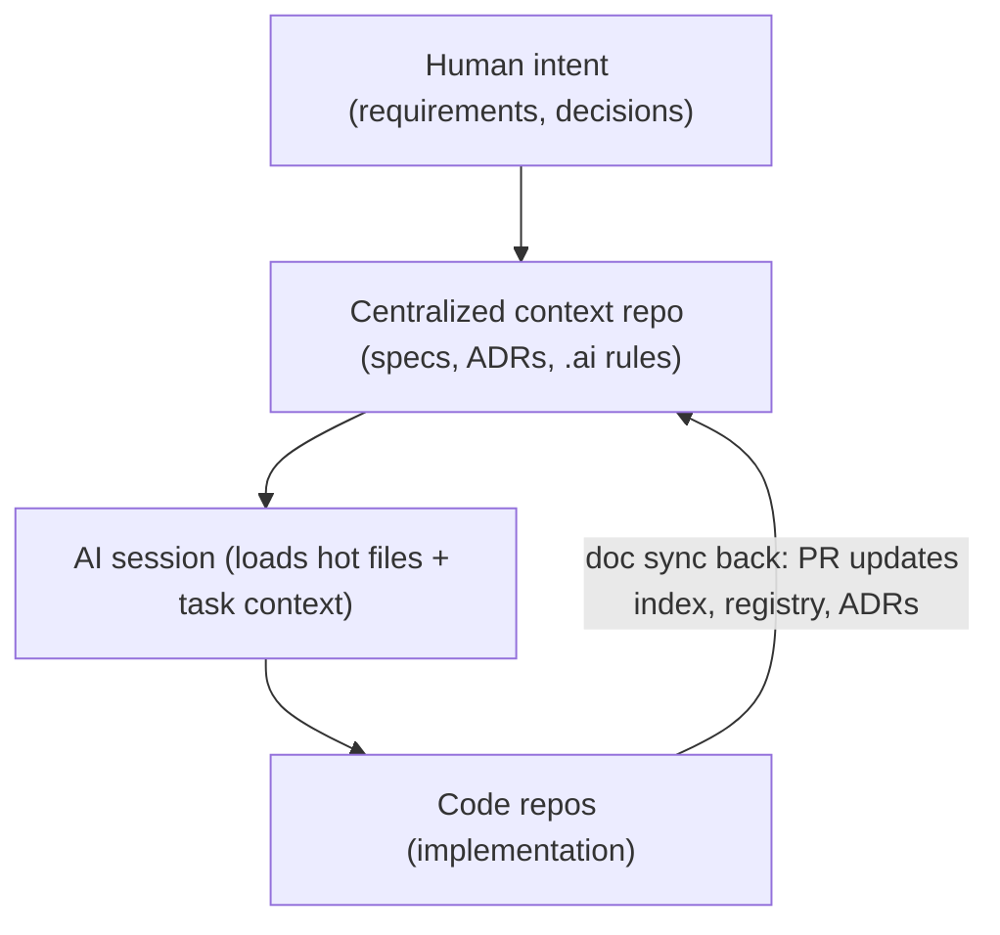

# Core Concepts

Shared vocabulary for all roles. New to AI-DLC? Read [What is AI-DLC?](00-what-is-ai-dlc.md) and [AI Assistant Basics](00-ai-assistant-basics.md) first. Any term you don't recognize is defined in the [glossary](glossary.md).

---

## Centralized context repo

A **single Git [repository](glossary.md#repository-repo)** that holds documentation, specifications, architecture decisions, and AI-optimized context files. It is the source of truth for **humans and AI assistants** across [AI sessions](glossary.md#ai-session) and across multiple code repositories. (New to Git or repositories? Start with [Repos, Git, and Terminals — a Primer for Everyone](00-repo-basics.md).)

**Why separate from code?**
- Specs and [Architecture Decision Records (ADRs)](glossary.md#architecture-decision-record-adr) outlive refactors
- Multiple code repos (iOS, Android, API) share one context
- AI loads structured docs without parsing entire codebases every session

---

## AI-first development model

In AI-DLC projects:

- **AI does 95–100% of coding**
- **Humans** provide direction, requirements, decisions, and validation
- Success depends on **efficient [context loading](glossary.md#context-loading)** and **[documentation sync](glossary.md#doc-sync)**

Why context loading decides success: every new AI session starts with zero memory of your project, so the files you load are everything the assistant knows. [AI Assistant Basics](00-ai-assistant-basics.md) teaches the mechanics — what a session is, how the context window works, and what "loading a file" actually means in both agentic tools and plain chat tools.

Three guides walk you through starting, running, and recovering sessions: `AI-SESSION-GUIDE.md`, `CONTEXT-RECOVERY.md`, and `.ai/SESSION-PROTOCOL.md` (in your context repo, created from the template).

---

## Tier-1 "hot files"

The four [Tier-1 hot files](glossary.md#tier-1-hot-files) are loaded at the start of **every AI session**, no exceptions. "Loading" means letting an agentic tool read the files from your folder, or pasting their contents into a plain chat — [AI Assistant Basics](00-ai-assistant-basics.md) shows both, step by step.

| File | Purpose |
|------|---------|
| `AGENTS.md` | Doc sync policy (applies to all AI tools) |
| `PROJECT-INDEX.md` | Curated current state — start here |
| `.ai/context/project-overview.md` | Condensed full project context |
| `.ai/AI-ASSISTANT-RULES.md` | Project-specific ALWAYS/NEVER coding rules (a [rules file](glossary.md#rules-file)) |

See [11.03 — Run an AI session](guides/11.03-run-ai-session.md) for the copy-paste load prompt.

---

## Phased documentation pipeline

Numbered folders map to lifecycle phases:

| Phase | Folder | Primary artifact |
|-------|--------|----------------|
| 0 | `docs/00-project-context/` | `PROJECT-CONTEXT.md` |
| 1 | `docs/01-concept/` | `CONCEPT-NOTE.md` |
| 2 | `docs/02-specification/` | `SPECIFICATION.md` (functional requirement [FR IDs](glossary.md#fr-ids), written `FR-*`) |
| 3 | `docs/03-context/` + `docs/03-architecture/` | `BUSINESS-TECH-CONTEXT.md`, ADRs |
| 4 | `docs/04-context-directories/` | Domain context slices — optional per-domain files the AI loads selectively |
| 5 | `docs/05-breakdown/` | [Module](glossary.md#module) docs, [sprint](glossary.md#sprint) plan, [tickets](glossary.md#ticket) |
| 6 | Code repos + `docs/06-development/` | Working software + index updates |

Full lifecycle: [05 — The six-phase lifecycle](05-six-phase-lifecycle.md)

---

## Index vs git history

Git automatically records every change ever made — the "git log". (If Git is new to you, see [Repos, Git, and Terminals — a Primer for Everyone](00-repo-basics.md).) The index and the log play different roles:

| Source | Role |
|--------|------|
| `PROJECT-INDEX.md` | Curated **current state** — phase, status, modules, decisions |
| Git log | Immutable **audit trail** — who changed what when |

Do not maintain a parallel changelog (a hand-written history of changes) unless the team explicitly commits to one.

---

## Agent-agnostic policy

`AGENTS.md` and `docs/process/*` apply to **any AI tool** — both [agentic tools](glossary.md#agentic-tool) that read files from your folder (e.g. Cursor, GitHub Copilot, Claude Code) and plain chat tools where you paste file contents (e.g. ChatGPT, Claude in the browser). Project-specific coding rules live in `.ai/AI-ASSISTANT-RULES.md`.

---

## Context flow diagram

"Doc sync back" happens in the same [pull request (PR)](glossary.md#pull-request-pr) as the code change; the "registry" is the API registry described in the next section.

---

## API documentation pattern (when applicable)

An API (application programming interface) is how one piece of software talks to another — for example, an app requesting data from a server. If your project has APIs, document them in three layers — keep them in sync:

| Layer | File | Contains |
|-------|------|----------|
| Registry | `BACKEND-INDEX.md` | [`api:*` IDs](glossary.md#api-registry-ids) + [readiness status](glossary.md#api-registry-status-values) for every endpoint |
| Contract | `docs/04-reference/*.md` | Paths and payloads (request/response data) for implementers |
| Deep context | `docs/05-breakdown/backend/` | Backend internals, edge cases |

Module breakdowns reference **`api:*` IDs only**, never raw URLs — the ID stays stable even when a URL changes.

---

## Context recovery tiers

An AI session loses its context whenever you start a new chat, the tool crashes, or the [context window](glossary.md#context-window) fills up. These tiers tell you how much to reload, depending on the situation (times = how long the reload takes):

| Tier | Time | Load |
|------|------|------|
| Emergency | ~60 sec | Index + AI rules |
| Standard | ~3 min | + project overview |
| Task | 5–10 min | + module / API / ADR for current work |
| Full onboarding | ~30 min | Phase docs 0–3 |

Note: "Tier-1 hot files" is the name of the four always-loaded files above — it is **not** one of these recovery tiers.

Details: [06 — Daily workflows](06-daily-workflows.md)

---

## Next steps

→ [The AI-DLC spine](ai-dlc-spine.md) — which of these concepts are non-negotiable  
→ [Glossary](glossary.md) — every term on this page, defined in plain language  
→ [03 — Bootstrap overview](03-bootstrap-overview.md) — folder layout  
→ [11.01 — Create a context repo](guides/11.01-create-context-repo.md) — create your repo

[← Playbook home](README.md)
