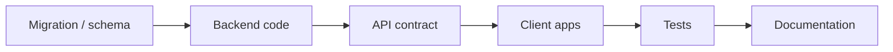

# Impact Analysis Before Change

**Senior developer mindset for AI-assisted work**

When a prompt sounds small — "rename this DB column," "add a field to the API," "change this config" — a junior developer (or an unchecked AI agent) may make the literal change and say "done." A senior developer stops first, maps the [blast radius](glossary.md#blast-radius) (everything the change could break), plans ordered steps, then executes.

This page defines when impact analysis is required, what to analyze, and the mandatory sequence before any file edits.

---

## The problem

| Approach | What happens | Risk |
|----------|--------------|------|
| **Junior / literal** | Renames column in one migration file | Broken ORM models, stale API responses, mobile clients crash, tests pass falsely, docs drift |
| **Senior / impact-first** | Maps consumers, plans migration → API → clients → docs → tests | Coordinated change, rollback path, nothing missed |

In AI-DLC, **the AI agent must behave like the senior developer** — even when the human prompt is narrow.

---

## When impact analysis is required

Run impact analysis **before any file edits** when the change touches:

- Database schema — columns, tables, indexes, constraints, types
- API contracts — paths, methods, request/response payloads, status codes, auth
- Shared libraries or public interfaces consumed by other services or apps
- Configuration or feature flags that change runtime behavior
- Dependency upgrades with known or possible breaking changes
- Any prompt that sounds "small" but affects **persistence** or **public interfaces**

**Rule of thumb:** If the change could break something that does not appear in the prompt, impact analysis is required.

Micro-fixes that genuinely touch one file with no downstream consumers (typo in a private helper, comment fix) may skip full analysis — but still require a one-line plan per `AGENTS.md`.

---

## Analysis dimensions

| Area | Questions to answer |
|------|---------------------|
| **Schema / DB** | Migration needed? Backfill existing rows? Downtime? Rollback script? |
| **Application code** | ORM models, entities, repositories, queries, DTOs, mappers affected? |
| **API layer** | Endpoints, serializers, validation, versioning — breaking or non-breaking? |
| **Clients** | Mobile (iOS/Android), web, third-party integrations — who consumes this? |
| **Tests** | Unit, integration, contract, E2E — what must be added or updated? |
| **Documentation** | `BACKEND-INDEX.md`, `docs/04-reference/`, module breakdown, ADRs, index? |
| **Operations** | Deploy order, feature flags, monitoring/alerts, data pipeline jobs? |

---

## Example: "Rename column `user_name` to `display_name`"

### What a junior might do

1. Edit migration: rename column
2. Say "done"

### What a senior (and AI agent) must do

1. **Search** codebase for `user_name` references — ORM, SQL, API serializers, mobile DTOs
2. **Plan migration** — single-step rename vs add-new-drop-old; backfill if needed
3. **Update API** — response field rename is **breaking** for mobile clients unless versioned
4. **Update clients** — iOS, Android, web model classes and parsing
5. **Update tests** — fixtures, mocks, contract tests
6. **Update docs** — API reference, `api:*` registry notes if field documented
7. **Deploy order** — API backward-compatible period? Dual-write? Feature flag?
8. **Present plan** — file table, ordered steps, rollback — **wait for approval**

---

## Mandatory sequence

| Step | Action |
|------|--------|
| 1 | Receive change request |
| 2 | **Stop** — do not edit files |
| 3 | Run impact analysis (prompt below) |
| 4 | Present plan + affected files table (per `AGENTS.md` in context repo) |
| 5 | Human approves plan |
| 6 | Execute in dependency order (migration → backend → API → clients → tests → docs) |
| 7 | Verify + run review checklist ([11-review-process.md](11-review-process.md)) |

**Recommended execution order for schema/API changes:**



---

## Copy-paste impact analysis prompt

```markdown
Before making any changes, perform a senior-level impact analysis.

Change requested: [describe the change]

Analyze and report:
1. Blast radius — all systems, files, and consumers affected
2. Database — migration, backfill, rollback strategy
3. API contracts — breaking vs non-breaking; registry updates needed
4. Client apps — iOS, Android, web, integrations affected
5. Tests — what must be added or updated
6. Documentation — BACKEND-INDEX, reference docs, ADRs, module breakdown
7. Deployment — order of operations and risks
8. Recommended implementation plan with ordered steps
9. Affected files table (path | action | summary)
10. What a junior might miss — explicit callout

Do NOT edit any files until I approve the plan.
```

---

## Add to your project's AI rules

Paste the snippet from [templates/AI-RULES-impact-analysis-snippet.md](templates/AI-RULES-impact-analysis-snippet.md) into `.ai/AI-ASSISTANT-RULES.md` so every session enforces this behavior.

---

## Related pages

- [11-prerequisites.md](11-prerequisites.md) — Level 4 change-type prerequisites
- [11-review-process.md](11-review-process.md) — impact review gate before merge
- [guides/11.03-run-ai-session.md](guides/11.03-run-ai-session.md) — clear session + plan approval
- `AGENTS.md` in your context repo — plan-before-act protocol

---

[← Review process](11-review-process.md) | [Playbook home](README.md)
