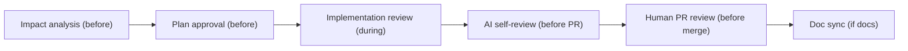

# Review Process

End-to-end review gates from impact analysis through merge. Applies to code, documentation, and architecture changes in AI-DLC projects.

---

## Review flow



---

## Review types

| Review | When | Owner | What to check |
|--------|------|-------|---------------|
| **Impact review** | Before schema/API/interface changes | Developer + architect if needed | [Blast radius](glossary.md#blast-radius) complete; migration/rollback; clients listed ([11-impact-analysis](11-impact-analysis-before-change.md)) |
| **Plan review** | Before any file edits | Prompt author (you) | Goal, steps, file table, risks (`AGENTS.md`) |
| **Implementation review** | During AI session | Developer | Each increment matches ticket; patterns per ADR-002 (the [conventionally second ADR](glossary.md#adr-001-and-adr-002-convention), recording the core architecture pattern); tests alongside code |
| **AI self-review** | Before opening PR | Developer + AI | Checklist below |
| **Human PR review** | Before merge | Sr dev / peer | Logic, security, tests, scope, no silent extras |
| **Doc review** | Docs or API PR | Doc [DRI](glossary.md#directly-responsible-individual-dri) | [11.13 — PR docs and APIs](guides/11.13-pr-docs-and-apis.md) light pass |
| **Deep architecture review** | Quarterly / pre-release | Architect DRI | `architecture-review-checklist.md` in context repo |

---

## Impact review (before execution)

**Required when:** Change touches DB, API contracts, shared interfaces, or cross-cutting config.

**Reviewer checks:**
- [ ] All consumers identified (not just the file in the prompt)
- [ ] Breaking vs non-breaking classified
- [ ] Migration and rollback strategy defined
- [ ] Deploy order documented
- [ ] Doc updates listed in plan
- [ ] "What a junior might miss" section addressed

**Outcome:** Approved plan — or request more analysis before proceeding.

---

## Plan review (before file edits)

Per `AGENTS.md` in your context repo:

- [ ] Goal stated clearly
- [ ] Every affected file listed (create / update / delete)
- [ ] No scope creep beyond request
- [ ] Explicit approval received before edits

---

## Implementation review (during session)

From `AI-SESSION-GUIDE.md` in your context repo:

- [ ] AI confirmed understanding before coding
- [ ] Incremental delivery — review each piece before next
- [ ] Code follows `AI-ASSISTANT-RULES.md` and ADRs
- [ ] Tests written or updated with code
- [ ] Working in correct repo (code vs context)

---

## AI self-review (before opening PR)

Copy-paste before creating PR:

```markdown
Review all changes we made in this session as a senior developer would before PR:

1. Does the change fully address the ticket acceptance criteria?
2. Blast radius — anything we missed (consumers, tests, docs)?
3. Breaking changes — are clients and API registry handled?
4. Tests — adequate coverage? Edge cases?
5. Code quality — patterns, naming, no dead code, no secrets
6. Documentation — BACKEND-INDEX, reference docs, module breakdown, ADRs needed?
7. Scope — only approved files changed?

List issues by severity (blocker / should-fix / nice-to-have).
Do not open PR until blockers are resolved.
```

---

## Human PR review (before merge)

**Reviewer focus:**

| Area | Look for |
|------|----------|
| Correctness | Meets acceptance criteria; edge cases handled |
| Impact | Coordinated change — not partial junior-style fix |
| Security | No secrets; auth respected; input validated |
| Tests | Meaningful tests; not trivial asserts |
| Architecture | Code follows the architecture pattern recorded in ADR-002; new ADR if a decision changed |
| Docs | Paired docs PR if contracts changed |
| Scope | Diff matches approved plan — no drive-by refactors |

**Roles:**

| Change type | Typical reviewer |
|-------------|------------------|
| Feature code | Sr dev or peer |
| API / schema | Sr dev + architect |
| Docs only | Doc DRI |
| ADR | Architect |

---

## Doc review (docs/API PR)

Follow [guides/11.13-pr-docs-and-apis.md](guides/11.13-pr-docs-and-apis.md):

- [ ] `PROJECT-INDEX.md` updated if status changed
- [ ] `BACKEND-INDEX.md` + `docs/04-reference/` synced
- [ ] ADR index updated if ADR added
- [ ] Internal links valid

---

## Deep architecture review (quarterly)

**Owner:** Architect DRI  
**Checklist:** `.ai/workflows/architecture-review-checklist.md`

- Spec ↔ breakdown ↔ ADR alignment
- `project-overview.md` matches reality
- API registry complete for release scope
- Pending decisions resolved or deferred with date

See [07-quality-and-maintenance.md](07-quality-and-maintenance.md).

---

## Review by role

| Role | Primary reviews |
|------|-----------------|
| Developer | Plan approval, implementation, AI self-review, request human PR review |
| Sr developer | Human PR review, impact review for cross-cutting changes |
| Architect | Impact review, ADR review, deep architecture review |
| PM | Spec review — requirements traceability (not code) |
| Doc DRI | Doc PR review, index accuracy |

---

[← Dos and don'ts](11-dos-and-donts.md) | [Impact analysis →](11-impact-analysis-before-change.md) | [Playbook home](README.md)
